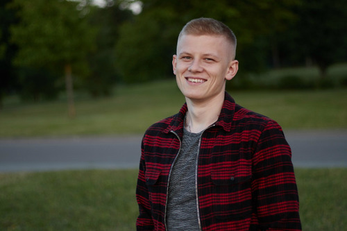

## Dmitry Bandysik 
#### _Date of birth:_ 25.06.1995
***
## Contacts:
* Email: *d.bandysik@gmail.com*
* Discord: *DmBand*
* Instagram: *dima.bandysik*
***
## Skills:
I'm learning Python programming lenguage. At the moment I'm writing my first small project in Django to automate one process in my current work.

#### *Python code example:*
```
# Simple Game
import random

some_mum = random.randint(1, 100)
attempt = 0

print('Я загадал число от 1 до 100. Сможете его отгадать? =)')

while True:
    attempt += 1
    answer = int(input('Ваш вариант? '))
    if answer == some_mum:
        print(f'Всё верно, это число {some_mum}! Количество попыток: {attempt}')
        break
    elif answer > some_mum:
        print('Моё число меньше...')
    elif answer < some_mum:
        print('Моё число больше...')
```
## About me
I want to get a job as a web developer.


