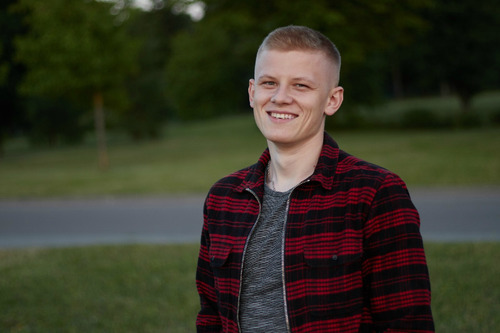

# Dmitry Bandysik 
#### _Date of birth:_ 25th June 1995
#### _Address:_ Grodno, Belarus

***

## Contacts
* Email: *d.bandysik@gmail.com*
* Discord: *DmBand*
* Instagram: *dima.bandysik*

***

## Education
* **2010-2014:** Grodno State Polytechnic College. Specialty: Highways. Construction technician
* **2014-2020:** Belarusian National Technical University. Specialty: Highways. Construction engineer

***

## Work experience
* **2014-2018:** Grodno, Road Operations Department No. 51, *Production Planning Engineer*
* **2018-2020:** Grodno, Welmares Premium LLC, *manager*
* **from 2020 to the present:** Grodno, Sogrei-M, *salesman*

***

## Skills
I'm learning Python programming lenguage. At the moment I'm writing my first small project in Django to automate one process in my current work.

#### *Python code example:*
```
# Simple Game
import random

some_mum = random.randint(1, 100)
attempt = 0

print('Я загадал число от 1 до 100. Сможете его отгадать?')

while True:
    attempt += 1
    answer = int(input('Ваш вариант? '))
    if answer == some_mum:
        print(f'Всё верно, это число {some_mum}! Количество попыток: {attempt}')
        break
    elif answer > some_mum:
        print('Моё число меньше...')
    elif answer < some_mum:
        print('Моё число больше...')
```

***

## Level of english
Elementary (A2). Studying on my own

***

## About me
I really want to get a job as a web developer.


